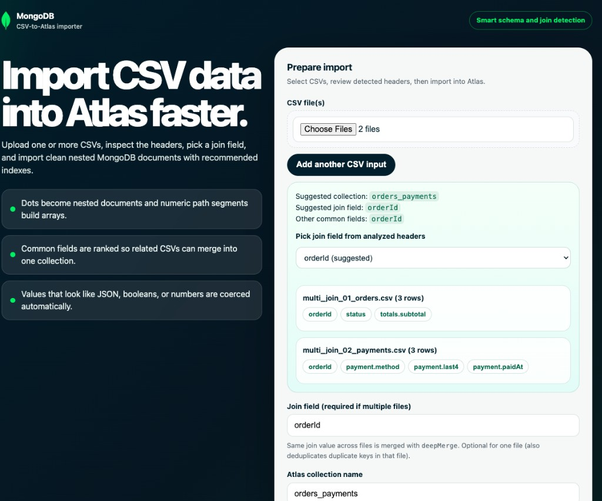

# CSV-to-Atlas Smart Importer

Upload a CSV (or use the CLI) to infer nested documents and arrays from column names, import into MongoDB Atlas, and create recommended indexes.

## Setup

1. Copy `.env.example` to `.env` and set `MONGODB_URI` (and optionally `MONGODB_DB`, default `csv_to_atlas`).
2. `npm install`
3. `npm run dev` — open [http://localhost:3333](http://localhost:3333) and upload a CSV.



## CLI

```bash
npm run import-cli -- samples/01_simple_flat.csv my_collection --drop
```

`--drop` replaces an existing collection with the same name.

You can also inspect files without connecting to MongoDB:

```bash
npm run import-cli -- samples/common_customer_01_customers.csv samples/common_customer_02_orders.csv samples/common_customer_03_support.csv --analyze
```

`--analyze` returns the parsed file headers, row counts, ranked common fields, a suggested join field, and a suggested collection name. It is useful before importing multiple related CSVs because it does not require `MONGODB_URI`.

When the collection name or join field is omitted, the importer suggests them from the CSV headers and file names:

```bash
npm run import-cli -- samples/common_customer_01_customers.csv samples/common_customer_02_orders.csv samples/common_customer_03_support.csv --drop
```

The example above detects `customerId` as the common join field and suggests `customers_orders_support` as the collection name.

### Multiple related CSVs (merge into one collection)

Use one **join field** (dotted path allowed) so rows with the same value are merged into a single document with `deepMerge`:

```bash
npm run import-cli -- samples/multi_join_01_orders.csv samples/multi_join_02_payments.csv merged_orders --join orderId --drop
```

With a single `--join`, you can also **deduplicate** rows inside one CSV that share the same key.

For one-to-many relationships, choose which CSV should be embedded as child rows on the parent document. The embedded CSV becomes an array field inferred from the file name, or you can set the array field with `:fieldName`:

```bash
npm run import-cli -- samples/multi_join_01_orders.csv samples/multi_join_02_payments.csv merged_orders --join orderId --parent multi_join_01_orders.csv --embed multi_join_02_payments.csv:payments --drop
```

Rows from the embedded CSV that share the same join value are appended to the parent document. Rows missing the join field or without a matching parent are reported in the merge stats.

Use repeated `--embed` flags to embed multiple child CSVs. The parent CSV cannot also be selected as embedded.

### Web UI analysis

Choose one or more CSV files in the web UI. The page calls `/api/analyze`, fills in the suggested **Join field** and **Atlas collection name**, and shows the top common-field candidates before import. You can keep the suggestions or override either value before clicking **Import & create indexes**.

When importing related CSVs, use **One-to-many embedding** to choose the **Parent CSV** and select any other CSV whose rows should be stored as an embedded child array on the matching parent document.

The `/api/import` endpoint also runs the same analysis server-side. If multiple files are uploaded without a join field, it uses the best suggested common field or returns the analysis payload so you can choose a field manually.

## Column naming

- **Dots** nest fields: `address.city` → `{ "address": { "city": "..." } }`.
- **Numbers** in the path are array indices: `items.0.sku` → `{ "items": [{ "sku": "..." }] }`.
- **Trailing `[]`** means the cell is one JSON value (often an array) at that path: `tags[]` with `["a","b"]` → `{ "tags": ["a","b"] }`.
- **Values** that look like numbers, booleans, or JSON objects/arrays are parsed automatically.

## Sample files

The `samples/` directory contains larger deterministic CSV fixtures so analysis, merge, embedding, and index recommendations can be exercised with hundreds or thousands of rows instead of toy data.

| File | What it exercises |
|------|-------------------|
| `samples/01_simple_flat.csv` | 250 flat user-style rows |
| `samples/02_nested_address.csv` | 250 nested `address` and `profile` rows |
| `samples/03_arrays_and_json.csv` | 250 rows with `tags[]`, nested `specs`, and JSON cells |
| `samples/04_line_item_rows.csv` | 250 order rows with arrays via `lineItems.0.*` |
| `samples/05_advanced_mixed.csv` | 250 nested event rows with `payload`, `payload.metrics[]`, and `meta` JSON |
| `samples/multi_join_01_orders.csv` + `multi_join_02_payments.csv` | 250 matching `orderId` rows — merge or embed payments with `--join orderId` |
| `samples/common_customer_01_customers.csv` + `common_customer_02_orders.csv` + `common_customer_03_support.csv` | 250 matching `customerId` rows — analyze or import using suggested join and collection names |
| `samples/user_table.csv` + `friends_table.csv` + `posts_table.csv` + `reactions_table.csv` | Larger social-graph-style tables for high-volume relationship testing |

**Merge behavior:** rows from every CSV that share the same join value (after CSV parsing) are combined into one document. Nested objects merge; arrays are aligned by index. Rows missing the join field are skipped (see `merge` stats in the JSON response).

**Embed behavior:** selected child CSVs are not merged into the parent shape directly. Instead, each matching child row is appended to an inferred or explicit array field on the parent document, preserving one-to-many relationships.

## Security

Do not commit `.env` or real connection strings. Rotate Atlas credentials if they were exposed.
